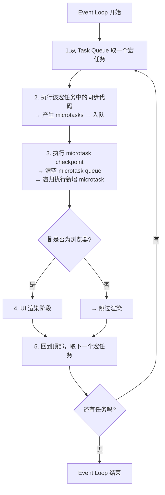

```mermaid
graph TD
    A[Event Loop 开始] --> B[1.从 Task Queue 取一个宏任务]
    B --> C[2. 执行该宏任务中的同步代码<br>→ 产生 microtasks → 入队]
    C --> D[3. 执行 microtask checkpoint<br>→ 清空 microtask queue<br>→ 递归执行新增 microtask]
    D --> E{🖥️ 是否为浏览器?}
    E -->|是| F[4. UI 渲染阶段<br>]
    E -->|否| G[→ 跳过渲染]
    F --> H[5. 回到顶部，取下一个宏任务]
    G --> H
    H --> I{还有任务吗?}
    I -->|有| B
    I -->|无| J[Event Loop 结束]
```
